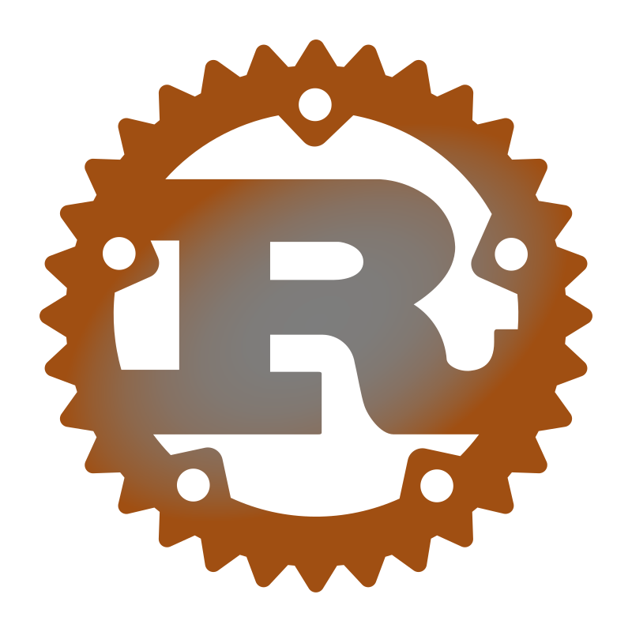
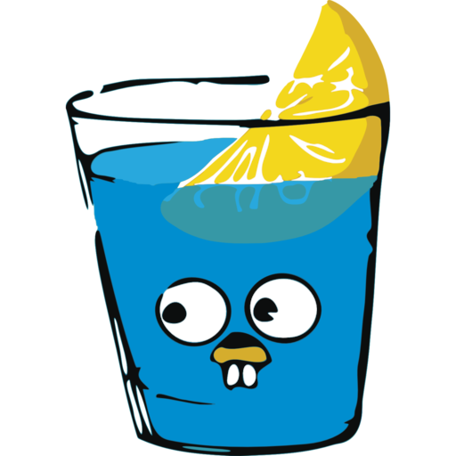
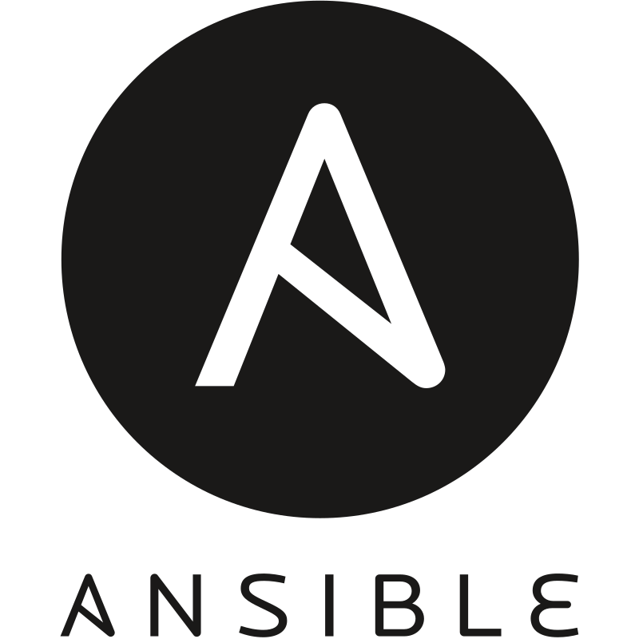
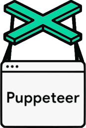

<h1 align="center">Hi 👋, I'm Movindu Lochana</h1>

Passionate and results-driven Full Stack Developer with a robust skill set in Java, Python, Go, and
    JavaScript. With a solid background in DevOps practices and a deep understanding of CI/CD pipelines, Kubernetes, and
    Docker, automating deployments and ensure seamless integration and delivery of software updates.
    Proficient with tools like Jenkins, GitLab CI, and Ansible. Excel in building scalable, high-performance backend
    systems, RESTful API design and microservices architecture. Strong knowledge of system design principles, capable of
    designing robust and scalable systems that address complex requirements and enhance performance and reliability

<h3 align="left">Connect with me:</h3>

    
    
    
    

<h3>I have experience working with a variety of technologies, and the following are the ones that I excels </h3>

<table style="border:none; width: 100%;">
    <tr>
        <td>
            <h4 align="left">Programming Languages</h4>
            

                
                
                
                
                
                
                <!-- C -->
                
                
                <!-- Kotlin -->
                
            

        </td>
        <td>
            <h4 align="left">Back End Frameworks</h4>
            

                
                <!-- Tokio and Axum -->
                
                <!-- Gin -->
                
                <!-- Bun -->
                
                
                
                <!-- fastAPI -->
                
                <!-- Elysiajs -->
                
                <!-- Hono -->
                
                
            

        </td>
    </tr>
    <tr>
        <td>
            <h4 align="left">DevOps</h4>
            

                <!-- helm -->
                
                
                
                <!-- Helm -->
                
                
                
                
                
                
                
                
            

        </td>
        <td>
            <h4 align="left">FrontEnd Frameworks and Liblaries</h4>
            

                
                
                
                
                <!-- Tanstack -->
                
                <!-- Zustand -->
                
                
                
                
                
            

        </td>
    </tr>
    <tr>
        <td>
            <h4 align="left">Mobile Frameworks</h4>
            

                
                
            

        </td>
        <td>
            <h4 align="left">Cloud Services and PaaS</h4>
            

                
                
                
                
                <!-- Vercel -->
                
                <!-- Railway -->
                
                <!-- Cloudflare -->
                
                
            

        </td>
    </tr>
    <tr>
        <td>
            <h4 align="left">Databases</h4>
            

                
                
                
                
                
                <!-- Timescale -->
                
                <!-- Neo4j -->
                
                
            

        </td>
        <td>
            <h4 align="left">AI ML Liblaries</h4>
            

                
                
                
                
                
            

        </td>
    </tr>
    <tr>
        <td>
            <h4 align="left">Data Visualization and Monitoring</h4>
            

                <!-- prometheus -->
                
                
                
                
                
            

        </td>
        <td>
            <h4 align="left">Testing Frameworks</h4>
            

                
                
                
                
                
                
            

        </td>
    </tr>
    <tr>
        <td>
            <h4 align="left">ORMs</h4>
            
            
            <!-- sqlx rust -->
            
        </td>
        <td>
            <h4 align="left">Asynchronous</h4>
            
            
        </td>
    </tr>
</table>